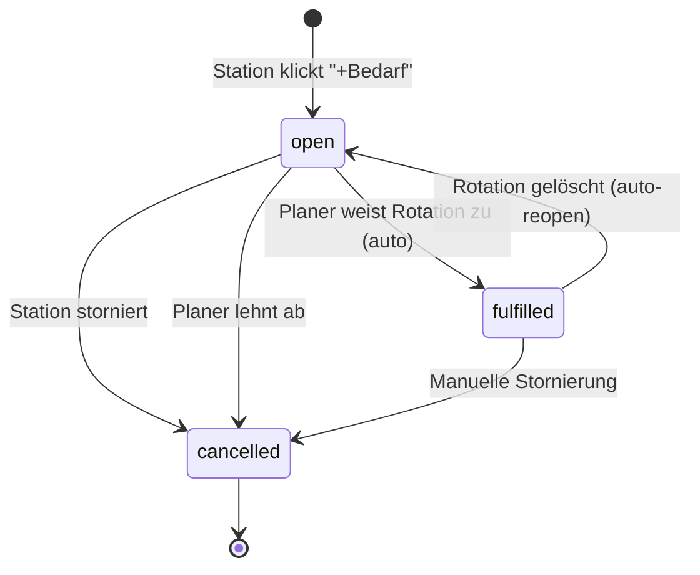

# Springerpool-Rotationen (Cross-Tenant Bedarfsanmeldung)

## Überblick

Diese Funktion ermöglicht es einem **Springerpool-Tenant**, Rotationen seiner flexiblen Pflegekräfte auf Stationen anderer Tenants zu verwalten. Die bediente Station (z.B. Gynäkologie) sieht im Schedule-Board eine **separate read-only Zeile "Springerpool"** mit den zugewiesenen Rotationen (Früh-/Mittel-/Spätschicht).

**Kern-Feature:** Stations-Mitarbeiter können per Klick auf eine Timeslot-Zelle **Bedarf anmelden** ("Wir brauchen Mittwoch einen Springer im Frühdienst"). Der Springerpool-Planer sieht diesen Bedarf in Echtzeit (In-App) und kann ihn durch Zuweisung einer Rotation automatisch erfüllen.

## Architektur

Alle Cross-Tenant-Daten leben in der **Master-DB** — die Tenant-Datenbanken bleiben unangetastet. Die Implementierung folgt dem bestehenden Cross-Tenant-Dienst-Muster (Verbundsdienste).

### Neue Tabellen (Master-DB)

| Tabelle | Zweck |
|---|---|
| `pool_ward_demand` | Bedarfsanmeldungen einer Station für einen Springer |
| `shared_shift_entry.timeslot_id` | Neue nullable Spalte für Timeslot-Unterteilung von Pool-Schichten |

### `pool_ward_demand` Schema

```sql
CREATE TABLE pool_ward_demand (
  id VARCHAR(36) PRIMARY KEY,
  shared_workplace_id VARCHAR(36) NOT NULL,   -- Springerpool-Station
  group_id INT NOT NULL,                      -- Verbund (tenant_group)
  ward_tenant_id VARCHAR(36) NOT NULL,        -- Anfordernde Station (db_tokens.id)
  date DATE NOT NULL,
  timeslot_id VARCHAR(36) DEFAULT NULL,       -- NULL = ganzer Tag
  note TEXT DEFAULT NULL,                     -- Optionale Notiz
  status VARCHAR(32) NOT NULL DEFAULT 'open', -- open | fulfilled | cancelled
  fulfilled_by_shift_id VARCHAR(36) DEFAULT NULL, -- shared_shift_entry.id
  created_by VARCHAR(255) DEFAULT NULL,
  created_at DATETIME(3),
  updated_at DATETIME(3)
);
```

### Datenfluss

```
Station (Gyn 1)                     Springerpool (Master-DB)            Springerpool-Planer
     │                                      │                                 │
     │── Klick auf Zelle ───────────────────→│                                 │
     │   POST /ward-demands                  │                                 │
     │   { shared_workplace_id, date,        │                                 │
     │     timeslot_id, note }               │                                 │
     │                                      │── broadcastUserEvent ──────────→│
     │                                      │   ('pool-ward-demand')          │ Realtime-Toast
     │                                      │                                 │
     │                              (open demand)                             │
     │                                      │                                 │
     │                                      │←── Planer weist Rotation zu ────│
     │                                      │   POST /:groupId/shifts          │
     │                                      │   { employee_id, billing_tenant │
     │                                      │     = ward_tenant_id, ... }     │
     │                                      │                                 │
     │                              markDemandFulfilledForCell()              │
     │                                      │                                 │
     │←── Badge grün ───────────────────────│                                 │
     │    "erfüllt"                         │                                 │
```

## Bedarf-Lebenszyklus



## API-Endpunkte

Alle unter `/api/groups/ward-demands` (in `server/routes/groups.js`):

| Methode | Pfad | Beschreibung | Berechtigung |
|---|---|---|---|
| `POST` | `/ward-demands` | Bedarf anlegen | Auth + eigener Tenant (via x-db-token) |
| `GET` | `/ward-demands?from=&to=&status=` | Bedarfe listen | Auth — Station sieht eigene, Admin alle |
| `PATCH` | `/ward-demands/:id` | Status ändern | Station: cancel eigener; Admin: alles |

### Auto-Erfüllung

Bei `POST /api/groups/:groupId/shifts` wird automatisch geprüft, ob ein offener Bedarf für die Zelle (`shared_workplace_id + billing_tenant_id (=ward_tenant_id) + date + timeslot_id`) existiert. Wenn ja, wird er auf `fulfilled` gesetzt und mit der `shared_shift_entry.id` verknüpft.

Wird eine erfüllende Rotation gelöscht (`DELETE /:groupId/shifts/:shiftId`), wird der Bedarf automatisch wieder auf `open` gesetzt.

### Erweiterung GET /visible-shifts

Die Response enthält jetzt ein zusätzliches `demands`-Array mit den Bedarfen des aktiven Tenants.

## Berechtigungsmodell

| Rolle | Bedarf anlegen | Bedarf stornieren | Bedarf erfüllen/ablehnen |
|---|---|---|---|
| Stations-Mitarbeiter (`user`) | ✅ (eigener Tenant) | ✅ (eigener Bedarf) | ❌ |
| Gruppen-Admin (`admin`/`group_admin`) | ❌ (nicht nötig) | ✅ | ✅ |

Die Prüfung erfolgt über:
- `x-db-token` → aktiver Tenant → `ward_tenant_id` muss übereinstimmen (für Stations-User)
- `app_users.group_admin_groups` enthält die `groupId` ODER `role = 'admin'` (für Planer)

## Timeslot-Unterstützung

- `shared_shift_entry` hat eine neue nullable Spalte `timeslot_id` (FK zu `shared_workplace_timeslot.id`)
- Bestehende tageweise Schichten (ohne Timeslot) bleiben voll funktionsfähig
- `shared_workplace.timeslots_enabled` steuert, ob eine Station Timeslots verwendet
- Im Board werden Timeslot-Zellen als Sub-Zeilen innerhalb der Cross-Tenant-Zelle dargestellt

## Setup (manuell durch Betreiber)

1. **Tenant "Springerpool" anlegen** via Master-Admin-UI
2. **Verbund (tenant_group) erstellen** — z.B. "Springerpool-Verbund"
3. **Springerpool-Tenant + bediente Stationen als Mitglieder** des Verbunds eintragen
4. **Shared Workplaces pro bedienter Station** anlegen — z.B. "Gyn 1" als `shared_workplace` mit `timeslots_enabled = true` und Timeslots (Früh-/Mittel-/Spätdienst)
5. **Springerpool-Stationen (shared_workplace.workplace)** den bedienten Tenants zuweisen via `shared_workplace_qualification` (optional)
6. **Benutzerrechte**: Springerpool-Planer benötigt `group_admin_groups` mit dem Verbund; Stations-Mitarbeiter benötigen nur `allowed_groups` (Leserecht)

## Bekannte Einschränkungen (V1)

- Keine Email-Benachrichtigung (nur In-App Realtime)
- Keine Qualifikations-/Prioritäts-Auswahl beim Bedarf
- Keine Auswertung/Reporting über Bedarfs-Historie
- Maximal ein offener Bedarf pro Zelle (shared_workplace_id + ward_tenant_id + date + timeslot_id)
